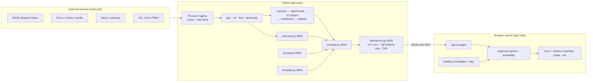
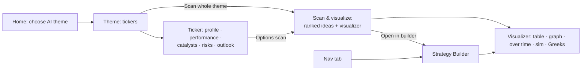
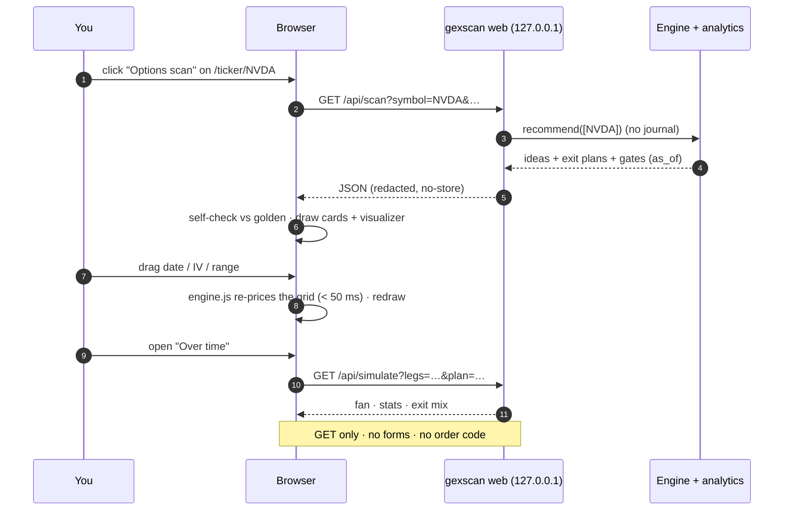

# gexscan v2.2: tech universe, local web app and strategy visualizer

**Status:** APPROVED, built (2026-10-02). Rev 3 (end of build) records what the code actually does where it refined the plan; those points are marked *(as built)*. Rev 2 replaces the static-site plan with a local web app. It adds the theme → ticker → scan flow and the Strategy Builder, switches the heatmap to green/red on a moon-silver matte UI, and folds in the requirements from `options-webapp-design-doc.md`.
**Visual companion:** [architecture.html](architecture.html): diagrams, page wireframes and the colour scale.
**How this was produced:** [../PROCESS.md](../PROCESS.md).

> gexscan only recommends and alerts. It never places, submits, modifies or cancels an order, in any broker, live or paper. The web app is read-only: the server answers GET and HEAD only, there are no forms, no order buttons and no broker links. All numbers are model estimates from delayed data. Not financial advice.

---

## 0. Summary

v2.2 has four parts.

1. **Tech universe.** Ideas come mainly from 12 technology themes (GPUs, CPUs, chips and foundry, memory, networking, optics and photonics, power semis, data centre, cooling, energy, AI infra, hyperscalers). Names outside it are scanned too, but they must clear a much higher bar, and they are shown in their own labelled section.
2. **Website (local web app).** `gexscan web` starts a server on 127.0.0.1 that serves the site and a read-only JSON API. The flow:
   - **Home**: pick an AI theme;
   - **Theme page**: the theme's tickers;
   - **Ticker page**: what the company does, how the stock has performed, catalysts, risks, outlook and the options picture;
   - **Options scan** button: runs the strategy engine on that ticker and opens the **Scan & visualize** page.
3. **Strategy visualizer.** OptionStrat-style (ideas, not code):
   - P/L $, P/L %, contract value and % of max risk across price and time;
   - a heatmap table (shiny green = profit, shiny red = loss) and a graph;
   - date, range and IV sliders that re-price instantly in the browser.
4. **Strategy Builder tab.** Pick any ticker and set up any trade: calls, puts, verticals, straddles, strangles, calendars, diagonals, iron condors, iron flies, butterflies, covered calls, cash-secured puts, or custom legs. See the visualization below.
   - A seeded Monte Carlo simulation plays out the exit plan (stop, target, time exit, invalidation) against "hold to expiry".

| Decision | Choice | Why |
|---|---|---|
| Delivery | Local web app: `gexscan web` binds 127.0.0.1, serves pages and a GET-only JSON API | The flow (theme → ticker → scan) and the builder need live data on demand, which a static site cannot do. Loopback-only and GET-only keep it read-only. |
| Server stack | Python stdlib `http.server` (threaded), no new dependency | Nothing new to vet or license. All methods except GET and HEAD are refused, so "read-only" is testable. |
| Front end | Vanilla ES modules + SVG + CSS grid. No framework, no build step, no npm. | No supply chain, no AGPL/GPL risk. Works offline. Easy to audit for order paths. |
| Where pricing runs | Black-Scholes-Merton in the browser (`engine.js`), checked against shared golden vectors | Sliders must respond in < 50 ms. Python stays the source of truth. |
| Where simulation runs | Python (numpy), seeded, on demand via `/api/simulate` | It is path-dependent and tested. The browser only draws the results. |
| Look | Moon-silver matte UI; the heatmap is a glossy tile grid on a graphite tray | Your request. The palette is validated (§6.9). |

**Your design doc (`options-webapp-design-doc.md`), and how this spec maps to it.** The requirements are kept:
- home scanner controls, opportunity cards and signal chips;
- visualizer header, expiration tabs and strike ladder;
- the full template list, the legs editor and the metrics row;
- Table/Graph × 4 metrics, the Date/IV/Range sliders, the < 50 ms drag target;
- the BSM-with-q formulas, `reprice()` kept separate from `probability()`;
- golden vectors shared by JS and Python;
- theme seeds, the hard rules and the phases.

The **stack** differs:
- your doc: React/TypeScript + FastAPI + `POST /scan`;
- here: stdlib server + vanilla JS + `GET /api/scan`.

The reasons are in the decision table. Endpoints map as follows:

| Your doc | Here |
|---|---|
| `/scan` | `GET /api/scan` |
| `/chains` | `GET /api/chain` |
| `/price-surface` | computed in the browser by `engine.js` (it is pure math; no round trip) |
| `/simulate` | `GET /api/simulate` |
| `/trades` | later (P6: positions); journaling stays in the CLI |

---

## 1. Goals and non-goals

**Goals**
- G1. Ideas come primarily from the tech universe. Outside names need a much higher bar and are labelled.
- G2. Navigate: theme → ticker → high-level overview → options scan → visualized ideas.
- G3. For any idea or hand-built trade, see how P/L $, P/L %, contract value and % of max risk change with price, time and IV. Dynamic, not a snapshot.
- G4. Probabilistic view: chance of profit, a P/L percentile fan over time, and "hold to expiry" compared with "follow the exit plan".
- G5. Builder: any ticker, any template or custom legs, same visualizer.
- G6. Keep every v2.1 guarantee: no order code, exit plans, freshness, disclaimers, redaction, no lookahead.

**Non-goals**
- Placing or staging orders, "trade" buttons, or broker links, ever.
- Streaming quotes. Data is CBOE delayed (~15 min) and cached; the page shows its age.
- Accounts, logins, multi-user hosting, or binding to anything except loopback.
- Exact American-option pricing (§6.6 limitations).

---

## 2. Rules carried forward, and web rules

All rules in [CLAUDE.md](../../CLAUDE.md) stay in force:
- no order code;
- an exit plan on every idea, and **No rolling**;
- no secrets;
- freshness, estimates and disclaimers;
- no mixed volume sources, no lookahead;
- defined risk by default;
- licences.

| # | Rule | Enforcement |
|---|---|---|
| W1 | **Loopback, read-only server.** The server binds `127.0.0.1` only; there is no option to bind other interfaces. GET and HEAD only: everything else gets 405. The Host header must be `127.0.0.1:<port>` or `localhost:<port>` (this blocks DNS rebinding). No CORS headers. | `tests/test_web.py` |
| W2 | **CSP and headers on every response:** `default-src 'none'; script-src 'self'; style-src 'self'; img-src 'self' data:; connect-src 'self'; form-action 'none'; base-uri 'none'; frame-ancestors 'none'`, plus `X-Content-Type-Options: nosniff`, `Referrer-Policy: no-referrer`, and `Cache-Control: no-store` on the API. | test |
| W3 | **No forms, no actions.** No `<form>` and no submit buttons. Inputs (selects, sliders, the ticker box) change only the view or a GET query. Text naming an action stays advisory ("Exit plan: …"). | grep test over `web/static` |
| W4 | **Safe DOM.** JS builds nodes with `createElement` / `textContent`. `innerHTML`, `outerHTML`, `insertAdjacentHTML`, `document.write`, `eval` and `new Function` are banned. `fetch` only through the `api()` helper, to relative `/api/` paths. | grep test |
| W5 | **No secrets, no internals.** API keys never leave the server: responses are built field by field from market data and chosen config values, never from the environment. Errors return a short message with no stack trace (the full error goes to the log, where `logutil.redact` masks keys). *(as built)* | `test_no_secret_in_any_response` sets every key in `.env.example` to a sentinel and checks every response |
| W6 | **Freshness.** Every payload carries `as_of` and its source. The header shows the mode (`LIVE · CBOE delayed` or `FIXTURES · synthetic`). | test |
| W7 | **Privacy.** The web app never writes the journal, positions or market snapshots *(as built: stricter than planned)*; scans run with `save_snapshots=False`. A fixtures demo uses a temporary state dir. Docs and tests use synthetic tickers only (DEMO, UPCO…). | review |
| W8 | **Guard covers the front end.** The no-order grep runs over `src/**/*.py`, and over `web/static/*.js`, `*.html` and `*.css`. | `test_v2.py::test_no_order_placement_code`, `test_web.py::test_front_end_has_no_order_code` |

---

## 3. Phase 0: carry-over fixes (applied)

| # | Fix | Behaviour after |
|---|---|---|
| F1 | Iron fly level stop: `earnings_crush._credit()` used the short strikes, which coincide on a fly, so the stop fired almost at once | The condor keeps its short strikes. The fly uses its **breakevens** (short strike ± credit). |
| F2 | Loss text not capped: `credit_exits()` printed `credit × (m − 1) × 100`, which can exceed the max loss | The text shows `min(loss, max_loss)` and says "capped at max loss". |
| F3 | Round-trip cost was gated only for calendars | Credit structures: round trip > `credit_roundtrip_warn` (50 %) of the credit gives a warning and a liquidity penalty. Above `credit_roundtrip_max` (100 %) the idea is dropped, with a gate reason. Both thresholds are in the signal sheet. |
| F4 | The per-trade budget was a warning only | New `risk.enforce_budget: false`. When true, over-budget ideas are dropped with a reason. |

---

## 4. Tech universe

### 4.1 Themes (overlaps allowed; edit `universe.themes` in config.yaml)

| Key | Home tile | Tickers |
|---|---|---|
| `gpus` | GPUs & AI accelerators | NVDA, AMD, AVGO, MRVL |
| `cpus` | CPUs | AMD, INTC, ARM |
| `chips_foundry` | Chips, foundry & equipment | TSM, ASML, AMAT, LRCX, KLAC, TSEM, INTC |
| `memory` | Memory & storage | MU, WDC, STX, SNDK |
| `networking` | Networking & interconnect | ANET, CSCO, AVGO, MRVL, CIEN, CRDO, ALAB |
| `optics` | Optics, lasers & silicon photonics | LITE, COHR, AAOI, FN, AXTI, POET |
| `power_semis` | Power semis | ON, MPWR, NVTS, VICR, POWI |
| `data_center` | Data centre | EQIX, DLR, SMCI, DELL, VRT, NBIS |
| `cooling` | Cooling & DC power | VRT, NVT, MOD, ETN |
| `energy` | Energy & power for AI | CEG, VST, TLN, GEV, BE, OKLO, CCJ |
| `infra` | AI infra & neoclouds | NBIS, CRWV, IREN, APLD, ORCL |
| `hyperscalers` | Hyperscalers | MSFT, GOOGL, META, AMZN, ORCL |

That is 56 unique names. Your design doc's seeds are merged in: the data-centre and cooling themes; CPUs and GPUs split out; POET, VICR, POWI, CSCO, EQIX, DLR, SMCI and DELL. Thin options are expected on some names; the liquidity gates drop untradeable legs.

**Outside the universe:** HOOD, BMNR, TQQQ, SPY, QQQ, IWM, AAPL, TSLA, COIN and PLTR. They are scanned, but held to the outside bar (§4.3).

In fixtures mode only, a `fixtures` theme (UPCO, DNCO, PINCO, EARN, RICH, TERM) is added for tests and demos.

### 4.2 Config

```yaml
universe:
  mode: prefer              # prefer | only | off. off = v2.1 behaviour (watchlist only)
  themes:
    gpus: {name: "GPUs & AI accelerators", tickers: [NVDA, AMD, AVGO, MRVL]}
    # … one entry per theme, as in §4.1
  outside:
    allow: true
    symbols: [HOOD, BMNR, TQQQ, SPY, QQQ, IWM, AAPL, TSLA, COIN, PLTR]
    min_confidence: 85      # High starts at > 70; outside names must clear 85
    max_per_day: 2
  concentration:
    max_ideas_per_theme: 3
    correlated_warn_pct: 0.60
```

With `mode: off`, `watchlist:` is used exactly as in v2.1.

*(as built)* YAML 1.1 reads `ON`, `YES`, `NO`, `Y` and `N` as booleans, so a ticker like ON must be quoted (`"ON"`). `load_universe` refuses a non-text ticker with a message saying so, rather than scanning a ticker called `True`.

### 4.3 Selection rules

1. **Preference is a filter, not a score boost.** Confidence measures the quality of the setup only.
2. Universe ideas are ranked as before (confidence, then liquidity, then credit/width) and fill `top_n`.
3. Outside ideas are shown only if confidence ≥ `outside.min_confidence` and they are within `max_per_day`. They appear in a separate **"Outside your universe"** section with a badge, and never take a universe slot. `mode: only` drops them.
4. At most `max_ideas_per_theme` ideas per theme in a run. Extras go to "Scored but not shown" with the reason, for example "theme cap (optics 3/3)".
5. Every idea carries its theme tags.
6. `recommend --theme optics,memory` limits a run to those themes. `-s` still overrides everything.
7. *(as built)* **Theme caps and the outside bar apply to the default run only** (no `-s`, no `--theme`). An explicit pick, including every web scan (a ticker page or a theme page), is yours and is not held back by them; its ideas still carry their theme tags, and the correlated-risk warning still runs.

### 4.4 Correlated risk

Most of this universe moves together. A run warns when more than `correlated_warn_pct` of the shown ideas' total max loss sits in one theme. This is a warning only.

---

## 5. Website and pages

### 5.1 Command

```
gexscan web [--port 8765] [--open] [--fixtures DIR --today YYYY-MM-DD] [--state DIR] [--no-news]
```

- It prints `http://127.0.0.1:8765/`. `--open` opens the browser.
- `Ctrl-C` stops it.
- Fixtures mode serves the synthetic names, so the site works offline.

### 5.2 Site map and flow

| Route | Page | Content |
|---|---|---|
| `/` | **Home: choose a theme** | One tile per theme: name, ticker chips and an "overlaps" note. In fixtures mode, the Fixtures tile. An "Outside the universe" tile. Market strip: VIX term structure and regime, as of. |
| `/theme/<key>` | **Theme** | One card per ticker: spot, 1-day and 1-month change, a 3-month sparkline, next earnings. Cards load progressively. The "Scan whole theme" button opens `/scan/theme/<key>`. |
| `/ticker/<SYM>` | **Ticker overview** | §5.3. Ends with a large **Options scan** button. |
| `/scan/<SYM>` and `/scan/theme/<key>` | **Scan & visualize** | §5.4: scan controls, opportunity cards, and the visualizer for the selected idea. |
| `/builder[?symbol=&legs=]` | **Strategy Builder** (tab) | §5.5 |
| `/about` | Method | Model, assumptions, data sources, licences, disclaimers, "never places orders", a link to PROCESS.md |

Nav tabs: **Themes · Strategy Builder · About**. The header shows the mode badge and the data age, and every page shows the footer disclaimer.

### 5.3 Ticker overview (`/api/ticker`)

All of it is rules-based from data, and labelled as estimates. If `ANTHROPIC_API_KEY` is set and news is on, an optional Claude summary of the headlines is shown, labelled as such. The key stays on the server.

| Block | Content | Source |
|---|---|---|
| Profile | Name, sector, industry, market cap, employees, 2–3 sentence business summary, website (shown as text, not a link) | yfinance `info` (cached daily); fixtures: `profiles.json` |
| Performance | Returns over 1W, 1M, 3M, 6M, YTD and 1Y, against SPY; 52-week range with position; drawdown from high; RV20; ATR %; beta and 60-day correlation to SPY | daily bars + benchmark |
| Price chart | 1-year closes with SMA 50/200, GEX put wall, call wall and flip, and the ±1σ expected-move band to the next monthly | daily bars, chain |
| Options picture | ATM IV, IV rank/percentile, expected move (front and monthly), term-structure shape, GEX regime, put/call OI | chain + `name_vol` |
| Catalysts | Next earnings (date, timing, days away, implied move against the average of the last 8 moves), ex-dividend, macro events (FOMC/CPI) before the monthly, news catalysts tagged by `news._tag` | events, macro, news |
| Risks | Rules, each with its number: an earnings gap inside the monthly; stretched (RSI > 70, or > 15 % above SMA50); in a downtrend (below SMA200); negative-gamma regime; high beta (> 1.5); IV rank > 80 (rich, moves priced in) or < 20; thin options; news red flags; deep drawdown (> 30 % off the high) | technicals, levels, nv, news |
| Outlook | A rules-based read: **Constructive / Neutral / Cautious**, from trend (SMA alignment), momentum (RSI, 1M relative strength), positioning (GEX regime, walls) and vol (IV rank). It lists the reasons and the expected range to the monthly. Labelled "a rules-based read of the data, not a forecast". | all of the above |
| News | Up to 8 headlines with provider and time, with red-flag tags | news providers |
| Freshness | Every source with its `as_of` | ctx.fresh |

### 5.4 Scan & visualize (`/api/scan`)

- **Controls** (from your doc's home scanner):
  - strategy filter (multi-select chips);
  - DTE window (min and max);
  - min confidence;
  - defined-risk only (on, and locked on unless `allow_undefined_risk` is configured);
  - max ideas.

  Changing a control re-runs the GET.
- **Opportunity cards**, ranked:
  - ticker, theme tags, strategy, confidence badge (Low/Medium/High);
  - legs, net, max loss and profit, POP, breakevens, DTE;
  - the stop (2× credit, or debit stop), the time exit, and **No rolling**;
  - the 3-level rationale (expandable) and signal chips (passed and warned gates).
  - Clicking a card loads it into the visualizer. **Open in builder** copies the legs into `/builder`.
- Below: "Scored but not shown" (with reasons) and "Gate summary" per strategy.
- The scan does not journal. It shows: "Not saved. To track it, use `gexscan journal take` after a CLI run."

### 5.5 Strategy Builder

- **Header:** a ticker box with universe suggestions (`<datalist>`). It shows spot, change, IV, as-of and the next event.
- **Expiration tabs** (from `/api/chain`), with DTE badges.
- **Templates** *(as built: 22, in six groups)*:
  - Basic: long call, long put, short call*;
  - Income: cash-secured put (the short put), covered call (with 100 shares), collar (100 shares, a short call, a long put);
  - Verticals: bull call, bear put, bull put, bear call;
  - Volatility: long straddle, long strangle, short straddle*, short strangle*;
  - Neutral: iron condor, iron butterfly, call butterfly, broken-wing butterfly (calls; wings 1 : 2, the near wing half the expected move);
  - Time: call calendar, put calendar, call diagonal, double calendar (the back month is the first expiry at least 21 days after the front);
  - custom: edit any template, or add legs by hand (up to 8).

  \* Undefined-risk templates show an **UNDEFINED RISK** badge and "% of max risk" shows UNDEFINED.

  A template picks strikes around spot (ATM, by delta such as 0.30/0.16, or by the expected move), and the legs stay editable. Not built as templates: put butterfly and double diagonal (build them from the legs editor).
- **Legs editor:** one row per leg:
  - Buy/Sell, Call/Put/Stock;
  - strike (select from the chain), expiry (select);
  - qty;
  - fill: mid, bid/ask (natural) or custom;
  - IV override;
  - remove.

  "Add leg" is limited to 8. Shares (covered call) have no expiry or IV.
- **Metrics row:**
  - net debit/credit, max loss, max profit, chance of profit, breakevens;
  - unrealized P/L at the current slider state (relative to the fills);
  - round-trip spread cost.
- The **visualizer** sits below (§6), the same component as on the scan page.
- **Strike ladder** for the active expiry: call and put OI bars, leg chips, walls and flip, spot, ±1σ. *(as built)* The ladder spans ±30 % around spot, widened so every leg on that expiry stays visible.
- Builder state lives only in the URL query (`?symbol=…&legs=…`), so it can be bookmarked. Nothing is stored on the server.

### 5.6 API (all GET; JSON; `Cache-Control: no-store`)

| Endpoint | Params | Returns |
|---|---|---|
| `/api/meta` | none | version, mode, today, disclaimer, `r`, theme count |
| `/api/themes` | none | `[{key, name, tickers, kind: universe/outside/fixtures}]` |
| `/api/quote` | `symbol` | spot, change 1D/1M, 3M closes (sparkline), next earnings, as_of, source |
| `/api/ticker` | `symbol` | §5.3 overview |
| `/api/scan` | `symbol` or `theme`; `strategies`, `dte_min`, `dte_max`, `min_confidence`, `defined_only`, `top` | ideas (each with legs, metrics, exit plan, viz block), outside ideas, rejected, gate summary, market, as_of, warnings |
| `/api/chain` | `symbol`, optional `expiry` | spot, as_of, r, q, expiries `[{expiry, dte, atm_iv, em}]`, strikes for the expiry `[{strike, C:{bid,ask,mid,iv,delta,oi,volume}, P:{…}}]`, levels, event |
| `/api/simulate` | `symbol`, `spot`, `legs` (`B:C:105:2026-12-11:1:6.30:0.61,…`), optional plan (`tp`, `stop`, `below`, `above`, `texit`), `event` (`date:move`), `n` (≤ 50,000), `seed` | fan percentiles by day, plan and hold stats, exit mix, histogram, the plan used, labels |
| `/api/golden` | none | the shared golden vectors for the browser self-check |

Validation:
- symbols match `^[A-Z][A-Z0-9.\-]{0,9}$`;
- numbers are parsed and clamped;
- at most 8 legs;
- unknown parameters are ignored.

Bad input returns 400 with a message. The in-memory cache has a TTL: 5 min live; for fixtures, the life of the process. Scans run one at a time behind a lock; other endpoints run 4 at a time.

**Derived inputs** *(as built)*:
- **Event** (`event` in `/api/chain` and each idea's viz block): the next earnings, dated on the session the move lands on. The move is the 1-sd log move, taken from the IV of the expiry holding the print against the next expiry, √(σ_e²·T − σ_b²·T); if that is not available, from the mean of past absolute moves × √(π/2). Moves under 0.5 % are ignored. The source is shown.
- **Dividend yield:** q = the last dividend × 4 ÷ spot (it assumes a quarterly payer), else 0.
- **An idea's plan in the visualizer** comes from the idea's own exit values, as fractions of its net: credit target = 1 − tp_value ÷ credit, stop = stop_value ÷ credit; debit target = tp_value ÷ debit − 1, stop = stop_value ÷ debit. The level stops and the time exit are the idea's own.
- **Legs** carry exact mids (for example 26.765), so the visualizer's net can show cents where the card rounds to dollars.

---

## 6. Strategy visualizer

### 6.1 Anatomy

1. **Header:** symbol, strategy, legs (for example `+1 105C / −1 115C · Dec 11`), theme tags, confidence; freshness.
2. **Metrics row:** net debit/credit, max loss, max profit, breakeven(s), chance of profit, unrealized P/L, round-trip cost.
3. **Exit plan box** (ideas): stop, profit target, time exit, invalidation, **No rolling**, and "Alert only. You place and manage every order yourself."
4. **Tabs:** **Table** (heatmap) · **Graph** · **Over time** (simulation fan) · **Simulation** (stats, exit mix, histogram) · **Greeks**.
5. **Metric toggle**, which drives Table, Graph and Over time: **P/L $ · P/L % · Contract value · % of max risk**.
6. **Controls row** (above the views, scoping all of them):
   - Date slider;
   - Range (± %);
   - IV multiplier ×0.3 to ×3 (×1/×2/×3 presets);
   - earnings IV-crush toggle (only when an event falls before expiry);
   - Reset.

### 6.2 Metrics

V(S, t) = Σᵢ sᵢ · qᵢ · Mᵢ · Pᵢ(S, t, σᵢ·m), where sᵢ = +1 long or −1 short, Mᵢ = 100 for an option and 1 for shares (a stock leg's qty counts shares), Pᵢ is the BSM value with q, and m is the IV multiplier. Shares count with P = S and no expiry.

NetBasis E = Σᵢ sᵢ · qᵢ · 100 · fillᵢ. It is positive for a debit and negative for a credit.

| Metric | Formula | Notes |
|---|---|---|
| Contract value | V(S, t) | Signed. Tooltip: "value to sell" or "cost to close". |
| P/L $ | V − E | All contracts |
| P/L % | (V − E) ÷ \|E\| | Credit: +50 % = the 50 % target. Debit: −100 % = the debit lost. |
| % of max risk | (V − E) ÷ \|MaxLoss\| | −100 % = max loss. Undefined risk shows UNDEFINED. |
| Greeks | Δ, Γ, Θ/day, vega per vol point (position) | At the cursor price and date. Θ is the 1-day change in value at the same price *(as built)*, so it includes the event crush and the expiry step. |

Max profit, max loss and breakevens come from a dense expiry grid (2,001 points from 0 to 3 × the highest strike, plus every strike exactly, so a butterfly's peak is on the grid; and slope checks at both ends for unbounded risk). A breakeven is where "P/L > 0" flips between two grid points, refined by bisection *(as built)*. Multi-expiry structures are measured at the **front** expiry, with back legs at BSM value.

### 6.3 Views

- **Table (heatmap):**
  - Rows are prices, with spot (dotted outline) and the breakevens highlighted.
  - Columns are dates: now → last expiry, at most 16. They always include each expiry and the event date.
  - Every cell prints the selected metric with a sign.
  - Hover or focus shows a tooltip with all four metrics.
  - It doubles as the accessible table view.
- **Graph:**
  - P/L against price for **Now (T+0)**, the **selected date** and **Expiry**;
  - the profit area under the expiry curve tinted green, the loss area tinted red;
  - markers: spot, breakevens, strikes, walls and flip;
  - a crosshair tooltip.
  - Below it, a **probability strip** shows the lognormal density at the selected date and "P(profit on <date>) ≈ x %". It shares the x axis, so the chart never has two y axes.
- **Over time:**
  - a simulation fan (median line, with 25–75 and 5–95 bands);
  - a "price stays at X" line;
  - reference lines for the target, stop and time exit;
  - a toggle: exit plan or hold.
- **Simulation:**
  - plan-against-hold tiles: P(profit), EV, median, CVaR 5 %, median days, P(stop), P(target);
  - an exit-reason bar;
  - an outcome histogram.
- **Greeks:** small multiples against price (one axis each) and a table at the cursor.

### 6.4 Controls

| Control | Range | Effect |
|---|---|---|
| Date | now → last expiry | Moves the selected-date curve, the highlighted heatmap column and the probability strip |
| Range | ±5 % to ±60 % | Heatmap rows, graph x domain |
| IV × | 0.3 to 3 | Every leg's IV × m (sticky strike). The simulation stays at ×1 and says so. |
| IV crush | on/off | After the event, remove the event variance (§6.6) |
| Metric | 4 metrics | All views |

**Performance:** a full re-price (25 prices × 16 dates × up to 8 legs, plus the graph's 241 × 3 points) must finish in < 50 ms on drag. Slider input is coalesced with `requestAnimationFrame`.

### 6.5 Debit plugins

New `bull_call` and `bear_put` plugins use the debit rules:
- max loss = the debit;
- take profit +50 % of the debit;
- value stop at 50 % of the debit;
- invalidation = the underlying closes beyond the nearer level (support for bull call, resistance for bear put);
- time exit halfway to expiry or at 21 DTE, whichever is earlier;
- **No rolling.**

Their gates are in the signal sheet:
- direction bullish (lean, trend);
- IV rank low or mid (buying premium);
- no earnings inside;
- liquidity.

### 6.6 Pricing model (`analytics/pricing.py` = `web/static/engine.js`)

- **BSM with q:**
  - d₁ = (ln(S/K) + (r − q + σ²/2)T) / (σ√T), d₂ = d₁ − σ√T;
  - Call = S·e^(−qT)·N(d₁) − K·e^(−rT)·N(d₂);
  - Put = K·e^(−rT)·N(−d₂) − S·e^(−qT)·N(−d₁).
- **Time:** T = calendar days to expiry ÷ 365, plus 16:00-close fractions. On the expiry date, legs are intrinsic.
- **IV per leg** (sticky strike):
  - if the chain IV is missing, use the expiry's ATM IV (flagged "IV estimated");
  - the IV × slider scales every leg.
- **Event variance:**
  - σ_post = √((σ²T₀ − σ_e²) / T₀) for valuation dates after the event, where σ_e = the implied move and T₀ = years from today to the leg's expiry;
  - the floor is 0.25 σ, which is flagged;
  - *(as built)* before the event, σ_pre = √(σ_post² + σ_e² / T) with T the time left from the valuation date. It equals σ today and rises into the event, so a calendar's value is consistent on both sides of the print.
- **Multi-expiry:** after the front expiry, the front leg is intrinsic (assumed settled).
- **Rates:** r = 4 % unless configured; q from the dividend data, else 0. Both are shown.
- **Code layout:** `reprice()` (value grids, metrics) and `probability()` (lognormal density, POP) are separate modules in both languages.
- **Limitations** (in the About page and the visualizer footer):
  - European pricing (no early exercise);
  - sticky strike;
  - mid prices.

### 6.7 Parity and self-check

- `src/gexscan/web/static/golden.json` holds the golden vectors: 40 BSM cases (calls and puts, with q, short and long T, deep ITM and OTM) plus 3 position cases. They are generated by `scripts/make_golden.py` from an independent scipy reference.
- `tests/test_pricing.py` checks `pricing.py` against them to 1e-9.
- `tests/js/parity.mjs` checks `engine.js` to 1e-6 relative. It is run by pytest when `node` exists.
- On page load, the browser runs the same check against `/api/golden`. If it fails, a red banner reads "Pricing self-check failed: numbers on this page may be wrong", and the charts are hidden.

### 6.8 Simulation (`analytics/simulate.py`)

- **Paths:**
  - N = 20,000 (configurable; capped at 50,000; cut further, and reported, when steps × paths × legs exceeds 30 M);
  - *(as built)* steps are **weekday closes to the front expiry** (not the last one: a calendar's story ends when the front leg settles). Each step's dt is its calendar gap ÷ 365, so the total variance matches BSM's calendar-day T;
  - seeded: the default seed is a hash of the request, so the same inputs give the same result.
- **Dynamics:**
  - GBM under the implied distribution (drift r − q);
  - piecewise forward volatility from the ATM term structure;
  - an event log-jump N(−σ_e²/2, σ_e) on the event date, with σ_post used for diffusion.
- **Repricing:** each leg is re-priced daily at its own IV, with the crush after the event.
- **Exit engine** (each daily close, in order):
  1. level stop / invalidation;
  2. value stop (credit: cost to close ≥ m × credit; debit: value ≤ the stop value);
  3. profit target;
  4. time exit;
  5. expiry (intrinsic).

  A second pass simulates "hold to expiry". Exits fill at mid.
- **Default plan** when none is given (the builder): the same rules as `recommend`:
  - credit: 50 % target, 2× stop, time exit by `time_exit_date`;
  - debit: +50 % target, 50 % value stop, the same time exit.
- **Outputs:**
  - fan p5/25/50/75/95 by day, for the plan and for hold;
  - P(profit), EV, median, CVaR 5 %, median days, exit mix, a 30-bin histogram.
- **Labels:**
  - "Simulated from implied volatility. Real paths jump, skew moves and gaps happen."
  - "Daily closes only: intraday stop touches are not seen."
- **Tests:**
  - the discounted mean payoff equals the BSM price within 3 standard errors;
  - P(S_T > K) ≈ N(d₂);
  - with constant vol and no event, the simulation equals plain GBM;
  - a credit stop loses at least 1× the credit and never more than the max loss *(as built: daily closes can gap past the stop, so "exactly 1×" was wrong)*; the stop accounting of one path is checked by hand;
  - the same seed gives identical results.

### 6.9 Visual design (moon-silver matte; dataviz method)

**UI tokens:**

| Token | Value | Use |
|---|---|---|
| `--bg` | `#c9cdd3` → `#bcc1c8` with a fine SVG noise (matte) | page |
| `--card` | `#dfe2e6` | cards, chart surface |
| `--card-edge` | `#eef0f2` top / `#aeb3ba` bottom | brushed-metal edge |
| `--tray` | `#3d4148` | heatmap tray (graphite) |
| `--ink` / `--ink2` / `--muted` | `#15181c` / `#3a3f46` / `#5a6068` | text |
| series 1/2/3 | `#1f6fcf` / `#c4501a` / `#0d8a5c` | Now / selected date / Expiry |

**Heatmap: diverging and shiny.**
- Each cell is a tile on the graphite tray with a 2 px gap.
- The fill is the data colour. A gloss overlay (a white-to-transparent gradient over the top half) and a 1 px inset highlight give the "shining" finish.
- Each arm is normalized to its own extreme (max profit, max loss). Interpolation is in OKLab.

| | loss pole | | | | | zero | | | | | profit pole |
|---|---|---|---|---|---|---|---|---|---|---|---|
| Steps | `#7f2924` | `#a83630` | `#ce5249` | `#e47c72` | `#e7a9a1` | `#cfd3d8` (silver) | `#98c9a1` | `#5cb572` | `#139948` | `#057836` | `#025a26` |

- **Validator results** (`validate_palette.js`):
  - each arm is monotone in lightness, with adjacent ΔL ≥ 0.06, a single hue and the light end at ≥ 5:1 against the tray: **PASS**;
  - the arms are matched in OKLab L within 0.003 at every step;
  - series 1–3 on `--card`: **PASS** for every check.
- **Green against red fails colour-blind separation** (deutan ΔE 1.8), as expected for that pair. Mitigations:
  - every cell prints its signed value (+12 % / −34 %);
  - loss cells carry a faint 135° hatch;
  - a **Colour-blind safe** toggle swaps the profit arm to blue (`#9abdeb` … `#124a89`; red against blue deutan ΔE 22.4, PASS).
- **Cell ink:** dark text (`#101316`) when the cell's L > 0.65, otherwise white.
- **Other rules:**
  - one axis per chart; the probability density is its own strip; Greeks are small multiples;
  - text uses the ink tokens, never series colours;
  - status colours are reserved for the self-check banner, stops and warnings, always with an icon and a label;
  - every chart has a hover layer (crosshair, or a per-cell tooltip), with hit targets of at least 24 px and the same tooltip on keyboard focus;
  - dark mode is deferred (the silver theme is the brand).

---

## 7. Modules

```
src/gexscan/
  analytics/bs.py            + q (dividend yield), backwards compatible
  analytics/pricing.py       NEW  legs, reprice(): value grids, metrics, Greeks, risk stats; probability(): lognormal POP
  analytics/simulate.py      NEW  Monte Carlo + exit-plan engine + aggregates
  analytics/overview.py      NEW  ticker overview: profile, performance, catalysts, risks, outlook
  engine/universe.py         NEW  themes, outside bar, theme caps, correlated-risk warning
  strategies/debit_verticals.py NEW bull_call / bear_put
  web/server.py              NEW  127.0.0.1 GET-only server, headers, routing, cache, locks
  web/api.py                 NEW  JSON builders for every endpoint
  web/static/                NEW  app.html (the page shell), silver.css, ui.js (DOM + api() + formats), charts.js (scales,
                                  axes, colour ramps), engine.js (pricing), viz.js (the visualizer), builder.js, app.js
                                  (router + pages), golden.json
  cli.py                     + `gexscan web`, `recommend --theme`
tests/
  test_pricing.py, test_simulate.py, test_universe.py (universe + Phase 0), test_web.py, js/parity.mjs
scripts/make_golden.py
```

---

## 8. Testing plan

| Area | Tests |
|---|---|
| Phase 0 | Fly stop at the breakevens; capped loss text; round-trip penalty and drop; `enforce_budget` on and off |
| Universe | Theme tags; outside bar and section; theme cap; `mode: off` = v2.1; correlated-risk warning |
| Pricing | Golden vectors; put-call parity with q; Greeks by finite difference; vertical max loss = debit and BE = K + debit; event-variance floor; multi-expiry front intrinsic |
| JS parity | `node tests/js/parity.mjs` (skipped without node) |
| Simulation | The §6.8 list |
| Web | GET pages 200 with CSP and headers; POST, PUT, DELETE, PATCH, OPTIONS and TRACE → 405; bad Host → 421; path traversal → 404; bad symbol → 400; `/api/ticker`, `/api/scan`, `/api/chain`, `/api/simulate` (with and without an event) on fixtures; the scan writes no journal rows; no secrets in responses; no `<form`; banned DOM APIs absent; fetch only via `api()`; "No rolling" the only form of the word |
| Guard | No-order grep over py, js, html and css |
| Visual | Browser-pane pass on fixtures: label collisions, tooltips, sliders, keyboard focus |

---

## 9. Phases

| Phase | Scope | Status |
|---|---|---|
| **P0** Fixes | F1–F4 | built, tested |
| **P1** Universe | config, `universe.py`, `--theme`, outside section, caps, correlated warning | built, tested |
| **P2** Pricing core | `bs.py` q, `pricing.py`, golden vectors, `engine.js`, parity | built, tested |
| **P3** Web app | server, API, Home, Theme, Ticker, Scan & visualize, Builder, About | built, tested, browser QA on fixtures |
| **P4** Simulation | `simulate.py`, Over time, Simulation tab | built, tested |
| **P5** Debit plugins | `bull_call`, `bear_put` | built, tested |
| **P6** Later | Positions & alerts page (read-only marks, 2× stop monitor), position history, American approximation, accuracy tracking (your doc's phase 5), dark mode | each needs approval |

Nothing is committed or pushed until you ask.

---

## 10. Defaults taken (formerly open questions; change any of them)

1. **Universe list:** §4.1, merged with your design doc's seeds.
2. **HOOD, BMNR, TQQQ:** moved to `outside.symbols` (scanned; must reach ≥ 85).
3. **Heatmap colours:** green/red as you asked, with the colour-blind toggle and signed numbers.
4. **Outside bar:** confidence ≥ 85, at most 2 a day.
5. **Delivery:** a local server, because your flow needs live data on demand.
6. **Debit plugins:** added (`bull_call`, `bear_put`).
7. **Phase 0:** F1–F4 applied.

---

## 11. Risks

| Risk | Mitigation |
|---|---|
| JS and Python pricing drift apart | Shared golden vectors, a parity test and a red banner |
| A local server is reachable by other sites (CSRF, DNS rebinding) | Loopback bind, a Host allow-list, GET-only with no side effects, no CORS, CSP `frame-ancestors 'none'` |
| Simulation read as a forecast | Labels on every simulated number; CVaR shown next to EV |
| A tech-heavy book is one correlated bet | Theme caps and the correlated-risk warning |
| Slow live scans (56 names) | Per-ticker scans in the web app; caching; rate limits; themes scanned on demand |
| Thin options on small names | Liquidity gates; a thin flag on the ticker page |
| Scope creep toward a trading app | W1–W8 and the guard tests; no order code, not even behind a flag |

---

## Appendix A: diagrams (the same diagrams are drawn in architecture.html)

### A.1 System architecture



### A.2 User flow



### A.3 Request flow: scan, then slide



### A.4 Simulation and exit plan

```mermaid
flowchart TD
  IN[Legs + IV, spot, r, q, term structure,<br/>event move, exit plan, seed] --> GEN[N paths: GBM + event jump]
  GEN --> DAY{Each trading day}
  DAY --> REP[Re-price legs, BSM<br/>IV crush after event]
  REP --> L1{Level stop /<br/>invalidation?}
  L1 -- yes --> X[Exit: day, reason, P/L]
  L1 -- no --> L2{Value stop?}
  L2 -- yes --> X
  L2 -- no --> L3{Profit target?}
  L3 -- yes --> X
  L3 -- no --> L4{Time exit?}
  L4 -- yes --> X
  L4 -- no --> DAY
  DAY -- expiry --> X
  X --> AGG[Fan by day · histogram · exit mix ·<br/>EV · CVaR · P(profit)]
  GEN --> HOLD[Hold-to-expiry pass] --> AGG
```
